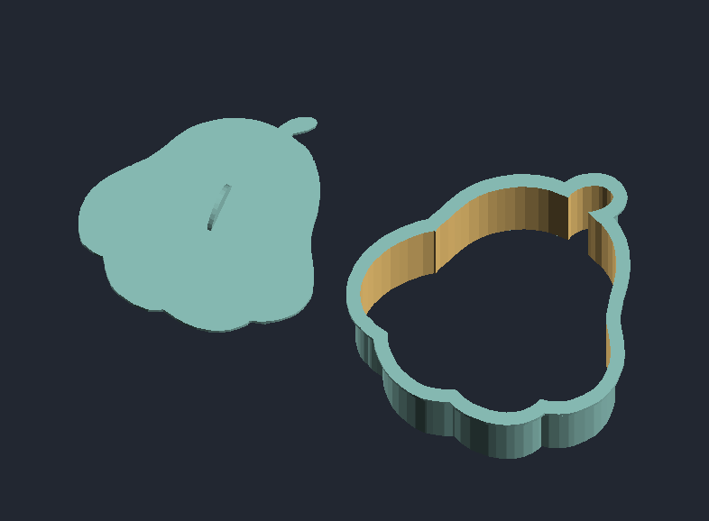
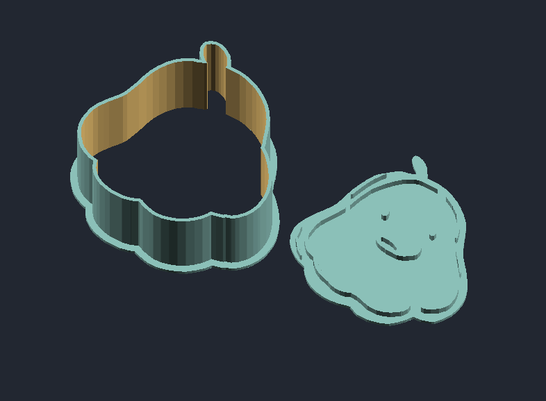

# Snackfee - An Even Dumber Project

I really enjoy the Drawfee Youtube Channel. On a recent VOD they talked about making cookie cutters.

This is source code that makes cookie cutters from the drawings on [this stream](https://youtu.be/CbkxY75rIl8?t=1238).

Turning this:

Into this:

That's the idea.

There is a .STL file in this project root directory that can be printed to make a cookie cutter. I don't have a printer myself, so I am not sure if everything is appropriately scaled.

This is a WIP.
